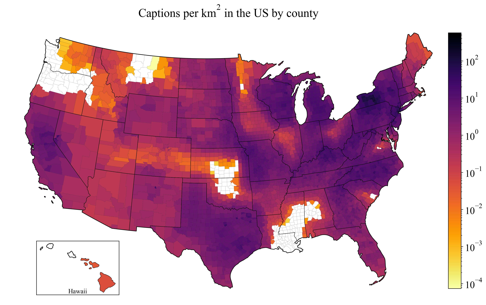

<div align="center">

### [RSTeller: Scaling Up Visual Language Modeling in Remote Sensing with Rich Linguistic Semantics from Openly Available Data and Large Language Models](https://arxiv.org/abs/2408.14744)
Vision-Language Dataset for Remote Sensing
</div>

### 🎉 News

- **2022/08/28**: A preprint version of our paper is now available on [arXiv](https://arxiv.org/abs/2408.14744).
- **2022/08/27**: The dataset is now available on the [Hugging Face Datasets Hub](https://huggingface.co/datasets/SlytherinGe/RSTeller).
- **2024/08/09**: We are uploading the dataset to the Hugging Face Datasets Hub.

### ⚡ Introduction

Abundant, well-annotated multimodal data in remote sensing are pivotal for aligning complex visual remote sensing (RS) scenes with human language, enabling the development of specialized vision language models across diverse RS interpretation tasks. However, annotating RS images with rich linguistic semantics at scale demands expertise in RS and substantial human labor, making it costly and often impractical. 

**To address this challenge, we propose a workflow that leverages large language models (LLMs) to generate multimodal datasets with semantically rich captions at scale from plain OpenStreetMap (OSM) data for images sourced from the Google Earth Engine (GEE) platform.** This approach facilitates the generation of paired remote sensing data and can be readily scaled up using openly available data. **Within this framework, we present RSTeller, a multimodal dataset comprising over 1 million RS images, each accompanied by multiple descriptive captions**. Extensive experiments demonstrate that RSTeller enhances the performance of multiple existing vision language models for RS scene understanding through continual pre-training. Our methodology significantly reduces the manual effort and expertise needed for annotating remote sensing imagery while democratizing access to high-quality annotated data. This advancement fosters progress in visual language modeling and encourages broader participation in remote sensing research and applications. 

### 🤖 Dataset Inspection

We provide a set of samples for quick evaluation. Image patch, raw OSM tags and the captions are provided.


### 💡 Dataset Statistics


<center>

| **Attribute**                   | **Value**                                              |
|---------------------------------|--------------------------------------------------------|
| Number of Images                | 1,197,190                                              |
| Number of Image-Text Pairs      | 2,539,256                                              |
| Image Source                    | National Agriculture Imagery Program (NAIP)            |
| Ground Sample Distance (GSD)    | 0.6 meters                                             |
| Pixel Dimensions                | 448 × 448 pixels                                       |
| Image Bands                     | Red (R), Green (G), Blue (B)                           |
| Image Capture Date Range        | August 1, 2021 - November 26, 2022                     |
| Geographic Coverage             | United States                                          |
| Image Acquisition Platform      | Aircraft                                               |

</center>

The geographical coverage of the dataset is limited to the United States due to the availability of NAIP imagery. 



### 🚀 Dataset Usage

The dataset is wrapped in webdataset tar shards for easy access and efficient data loading. There are 240 tar shards in total.

#### Download

The dataset is available on [huggingface](https://huggingface.co/datasets/SlytherinGe/RSTeller). You can download the dataset using the following command with the [huggingface-cli](https://hf-mirror.com/docs/huggingface_hub/guides/download#download-from-the-cli):

```bash
huggingface-cli download --repo-type dataset --resume-download SlytherinGe/RSTeller --local-dir LOCAL_PATH/TO/YOUR/DATA
```

If your are trying to download the dataset from mainland China, a [mirror endpoint](https://hf-mirror.com/) is recommended for faster download speeds.

#### Requirements

To read the dataset in a python environment, you need to install the `webdataset` package. Details about the webdataset package can be found [here](https://github.com/webdataset/webdataset).

```
pip install webdataset
```

#### Data Arrangement

The dataset is arranged in the following way:

```
├── RSTeller
│   │── Patches0000.tar
|   |   |── 607.jpg
|   |   |── 607.json
|   |   |──...
│   ├── Patches0001.tar
│   ├──...
│   ├── Patches0240.tar
```

The `Patches0000.tar` file contains the image patches, metadata and their captions. Each image patch is named as `607.jpg`, where `607` is the unique identifier of the image patch. The corresponding metadata and captions are stored in `607.json`.

A sample json file is shown below:

```json
{
    "metadata": {
        "patch_id": 607,
        "image_name": "m_4107501_ne_18_060_20221108"
    },
    "annotations": [
        {
            "task": 2,
            "text": "In the remote sensing image patch, a roadway extends diagonally from the left-top to the right-bottom, curving sinuously. Running in a roughly northwest-southeast orientation, it spans approximately 339 meters within the ROI. Likely representing a public access road, it may indicate a rural or natural area. The road's name is Lower Rhiney Creek Road, and it has not been formally reviewed."
        },
        {
            "task": 3,
            "text": "The image reveals a roadway, likely a public access road, curving diagonally from left-top to right-bottom, spanning approximately 339 meters. This road may indicate a rural or natural area, potentially bordered by vegetation or fields."
        }
    ]
}
```

The "metadata" field contains the unique identifier of the image patch and the corresponding image name where this image patch is taken from. The "annotations" field contains the captions for the image patch. Each caption is associated with a task number, which indicates the type of caption. The task numbers and their corresponding caption types are as follows:

- Task 1: Area description
- Task 2: Non-area description
- Task 3: Caption revision

In RSTeller dataset, each image patch has one Task 1 or Task 2 caption, and multiple Task 3 captions, ranging from 1 to 4 captions per image patch. The Task 3 caption provides more diverse expressions of the same image patch, which can be useful for training a robust model.

#### Data Loading

To load the dataset, you can use the following code:

```python
import webdataset as wds
import random

def preprocess_img(img):
    # preprocess the image
    return img

def text_tokenize(text):
    # tokenize the text
    return text

input_shards = "/PATH/TO/RSTeller/JPG/train-{000000..000239}.tar"

pipeline = [wds.SimpleShardList(input_shards),
            wds.shuffle(100),
            wds.tarfile_to_samples(),
            wds.decode("pil"),
            wds.rename(image="jpg", text="json"),
            # randomly sample one caption per image patch
            wds.map_dict(text=lambda x: random.choice(x['annotations'])['text']),
            wds.map_dict(image=preprocess_img, text=text_tokenize),
            wds.shuffle(1000),
            wds.to_tuple("image", "text")
            ]

dataset = wds.DataPipeline(*pipeline)
dataloader = wds.WebLoader(
    dataset,
    batch_size=None,
    shuffle=False
)

it = iter(dataloader)
example = next(it)
print(example)
```


The `shuffle` function is used to shuffle the dataset. The `decode` function is used to decode the image patches. The `to_tuple` function is used to convert the image patches and captions to tuples. The first element of the tuple is the image patch, and the second element is the sampled caption. The `map_dict` function is used to preprocess the image and tokenize the text. The `rename` function is used to rename the image and text files to `jpg` and `txt` respectively

You can then iterate over the dataset using a for loop:

```python
for image, caption in dataset:
    # process the image and caption
```

### 📄 Citation

If you find the dataset and our paper useful, please consider citing our paper:

```bibtex
@misc{ge2024rstellerscalingvisuallanguage,
      title={RSTeller: Scaling Up Visual Language Modeling in Remote Sensing with Rich Linguistic Semantics from Openly Available Data and Large Language Models}, 
      author={Junyao Ge and Yang Zheng and Kaitai Guo and Jimin Liang},
      year={2024},
      eprint={2408.14744},
      archivePrefix={arXiv},
      primaryClass={cs.CV},
      url={https://arxiv.org/abs/2408.14744}, 
}
```
